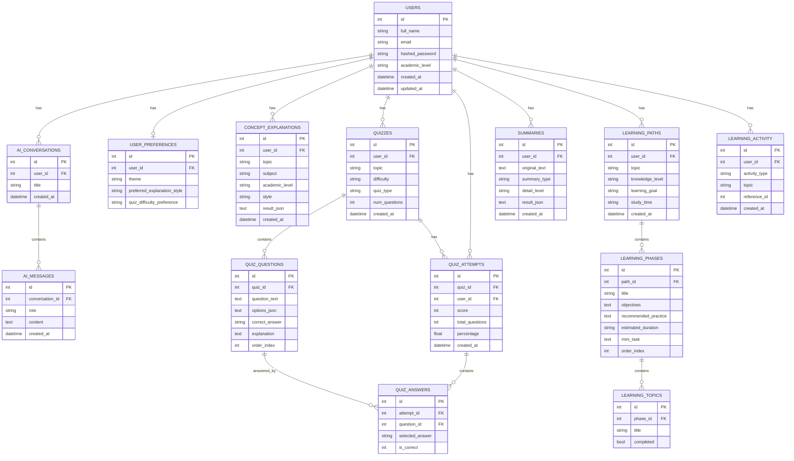

# EduGenie — Google Gemini Powered Learning Assistant

EduGenie is a full-stack AI educational assistant. Students ask questions, get concepts explained at their level, generate quizzes, summarize study material, and build personalized learning roadmaps — all backed by Google Gemini through a secure FastAPI backend.

---

## Table of Contents

1. [Problem Statement & Solution](#problem-statement--solution)
2. [Key Features](#key-features)
3. [Technology Stack](#technology-stack)
4. [System Architecture](#system-architecture)
5. [Database Design & ER Diagram](#database-design--er-diagram)
6. [Project Folder Structure](#project-folder-structure)
7. [Local Setup](#local-setup)
8. [Gemini API Setup](#gemini-api-setup)
9. [Running Tests](#running-tests)
10. [API Documentation](#api-documentation)
11. [Deployment Guide (Render)](#deployment-guide-render)
12. [GitHub Upload Guide](#github-upload-guide)
13. [Production Testing Checklist](#production-testing-checklist)
14. [Mentor Demonstration Script](#mentor-demonstration-script)
15. [Future Enhancements](#future-enhancements)
16. [Team](#team)
17. [License](#license)

---

## Problem Statement & Solution

**Problem:** Students and self-learners often struggle to get instant, level-appropriate help — a tutor isn't always available, generic search results aren't structured for learning, and building a study plan or quiz from scratch takes real effort.

**Solution:** EduGenie centralizes six AI-assisted learning workflows (Q&A, concept explanation, quiz generation, summarization, learning paths, and recommendations) behind one clean, secure interface, with every interaction tracked so progress compounds over time.

## Key Features

- Full JWT authentication (registration, login, protected routes, hashed passwords)
- AI Assistant: conversational, level-adapted Q&A with history
- Concept Explainer: structured explanations in 5 styles
- Quiz Generator: MCQ / True-False / Mixed, scored with explanations, retakeable
- Text Summarizer: 4 summary types × 3 detail levels, downloadable notes
- Personalized Learning Paths: phased roadmaps with per-topic progress tracking
- AI-generated study recommendations based on real quiz performance
- Unified learning history with filtering and deletion
- Editable profile, stats, and persisted preferences (theme, difficulty, style)
- Light/Dark theme, fully responsive, accessible design system

## Technology Stack

**Backend:** Python, FastAPI, Uvicorn, Pydantic v2, SQLAlchemy ORM
**AI:** Google Gemini API (`google-genai` SDK, current non-deprecated client)
**Frontend:** HTML5, CSS3 (custom design system, no framework), Vanilla JavaScript
**Database:** SQLite (dev) — swappable to PostgreSQL via `DATABASE_URL` with zero code changes
**Auth:** JWT (python-jose) + bcrypt password hashing (passlib)
**Testing:** Pytest + FastAPI TestClient
**Deployment:** Render (or any ASGI-compatible host)

## System Architecture

```
┌──────────────────┐        HTTPS/JSON        ┌───────────────────────┐        ┌───────────────┐
│  Frontend (SPA-   │  ───────────────────────▶│   FastAPI Backend      │───────▶│  Google Gemini │
│  style, static     │◀───────────────────────  │   (JWT-protected REST) │◀───────│  API           │
│  HTML/CSS/JS)      │                          │   app/routers/*        │        └───────────────┘
└──────────────────┘                          │   app/services/*        │
        ▲                                        │   app/prompts/*         │
        │  served by any static host              └──────────┬─────────────┘
        │  (Render Static Site / Netlify / etc.)              │
        │                                              SQLAlchemy ORM
        │                                                      ▼
        │                                            ┌───────────────────┐
        └────────────────────────────────────────────│  SQLite / Postgres │
                                                       └───────────────────┘
```

All Gemini calls happen server-side inside `app/services/gemini_service.py` — the API key never reaches the browser. The frontend only ever talks to the FastAPI backend over `/api/*`.

## Database Design & ER Diagram



Every AI-generated result (concept explanations, summaries) is stored as validated JSON in a `result_json` column, so the API can return strongly-typed Pydantic responses while keeping the schema flexible for AI output.

## Project Folder Structure

```
edugenie/
├── backend/
│   ├── app/
│   │   ├── main.py                  # FastAPI app, CORS, routers, global error handler
│   │   ├── core/
│   │   │   ├── config.py            # Settings (env vars) - single source of truth
│   │   │   └── security.py          # Password hashing + JWT
│   │   ├── database/
│   │   │   └── database.py          # SQLAlchemy engine/session
│   │   ├── models/                  # SQLAlchemy ORM models (one file per domain)
│   │   ├── schemas/                 # Pydantic request/response schemas
│   │   ├── routers/                 # APIRouter per feature (auth, quizzes, etc.)
│   │   ├── services/                # Gemini service + business logic/validation
│   │   ├── prompts/
│   │   │   └── educational_prompts.py  # All prompt templates, centralized
│   │   └── dependencies/
│   │       └── auth.py              # get_current_user JWT dependency
│   ├── tests/                       # Pytest suite
│   ├── requirements.txt
│   └── .env.example
├── frontend/
│   ├── index.html                   # Landing page
│   ├── pages/                       # login, register, dashboard, assistant, ...
│   ├── css/                         # variables, global, components, landing, dashboard, responsive
│   ├── js/                          # api.js (central client), layout.js, per-page logic
│   └── assets/
├── render.yaml
└── README.md
```

## Local Setup

### Prerequisites
- Python 3.11+
- A modern browser
- (Optional) A simple static file server for the frontend — Python's built-in one works fine

### 1. Clone and enter the project
```bash
git clone https://github.com/YOUR_USERNAME/edugenie.git
cd edugenie
```

### 2. Backend setup
```bash
cd backend
python3 -m venv venv
source venv/bin/activate        # Windows: venv\Scripts\activate
pip install -r requirements.txt
cp .env.example .env
```

Open `.env` and set at minimum:
```
GEMINI_API_KEY=your_real_gemini_api_key
SECRET_KEY=some_long_random_string
ALLOWED_ORIGINS=http://localhost:5500,http://127.0.0.1:5500
```

### 3. Run the backend
```bash
uvicorn app.main:app --reload --port 8000
```
The database (`edugenie.db`) and all tables are created automatically on first startup. API docs are live at `http://127.0.0.1:8000/docs`.

### 4. Run the frontend
In a separate terminal:
```bash
cd frontend
python3 -m http.server 5500
```
Open `http://127.0.0.1:5500/index.html` in your browser. The frontend auto-detects `localhost` and points API calls at `http://127.0.0.1:8000` — no config needed for local dev (see `js/api.js`).

## Gemini API Setup

1. Go to [Google AI Studio](https://aistudio.google.com/apikey) and sign in.
2. Click **Create API key**, choose or create a Google Cloud project.
3. Copy the generated key.
4. Paste it into `backend/.env` as `GEMINI_API_KEY=...`. Never commit this file — it's already in `.gitignore`.
5. `GEMINI_MODEL` defaults to `gemini-2.0-flash`; change it in `.env` if you want a different model.

## Running Tests

```bash
cd backend
source venv/bin/activate
pytest -v
```
Tests cover registration validation (duplicate email, password strength, mismatch), login success/failure, protected-route access, and AI-response validation logic (quiz/learning-path JSON validation) without making live Gemini calls.

## API Documentation

FastAPI auto-generates interactive docs:
- Swagger UI: `http://127.0.0.1:8000/docs`
- ReDoc: `http://127.0.0.1:8000/redoc`

Endpoints are grouped by tag (Authentication, Users & Profile, AI Assistant, Concept Explainer, Quiz Generator, Text Summarizer, Learning Paths, Dashboard, Learning History) with descriptions and typed request/response schemas.

## Deployment Guide (Render)

### Step 1 — Push to GitHub
See [GitHub Upload Guide](#github-upload-guide) below.

### Step 2 — Deploy the backend
1. Go to [render.com](https://render.com) → **New** → **Web Service**.
2. Connect your GitHub repo.
3. Render will detect `render.yaml` automatically (Blueprint), or configure manually:
   - **Root Directory:** `backend`
   - **Build Command:** `pip install -r requirements.txt`
   - **Start Command:** `uvicorn app.main:app --host 0.0.0.0 --port $PORT`
4. Under **Environment**, add:
   - `GEMINI_API_KEY` — your real key (mark as secret)
   - `SECRET_KEY` — a long random string
   - `ALLOWED_ORIGINS` — your deployed frontend URL (add it after Step 3)
5. Deploy. Note the backend URL, e.g. `https://edugenie-backend.onrender.com`.

### Step 3 — Deploy the frontend
1. Render → **New** → **Static Site**.
2. Same repo, **Root Directory:** `frontend`, **Publish Directory:** `.` (no build step needed).
3. Before deploying, set the API base URL: add a small script tag in `frontend/index.html`'s `<head>` (and each page) or simply set it once globally — the cleanest approach is to add this line right before the `api.js` script tag on every page:
   ```html
   <script>window.EDUGENIE_API_BASE_URL = "https://edugenie-backend.onrender.com";</script>
   ```
4. Deploy. Note the frontend URL, e.g. `https://edugenie-frontend.onrender.com`.

### Step 4 — Connect them
Go back to the backend service's environment variables and set:
```
ALLOWED_ORIGINS=https://edugenie-frontend.onrender.com
```
Redeploy the backend so CORS accepts requests from the live frontend.

### Step 5 — Test production
Visit your frontend URL, register an account, and run through the demo scenarios below.

### Step 6 — Update after changes
Push to `main` — Render auto-deploys both services on every push (unless auto-deploy is disabled in settings).

## GitHub Upload Guide

```bash
cd edugenie
git init
git add .
git commit -m "Initial commit: EduGenie full-stack AI learning assistant"
git branch -M main
git remote add origin https://github.com/YOUR_USERNAME/edugenie.git
git push -u origin main
```
Double-check `backend/.env` is **not** tracked (`git status` should not show it — `.gitignore` already excludes it).

## Production Testing Checklist

- [ ] Register a new account with a weak password → rejected with a clear message
- [ ] Register with an already-used email → 409 conflict, clear message
- [ ] Log in with correct / incorrect credentials
- [ ] Refresh the dashboard while logged in → stays authenticated
- [ ] Ask a question in AI Assistant → response streams in, appears in History
- [ ] Generate a concept explanation in each of the 5 styles
- [ ] Generate a 5/10/15 question quiz, submit it, confirm scoring and explanations
- [ ] Paste text into the Summarizer, confirm all 4 summary types work, download .txt
- [ ] Toggle Light/Dark theme, refresh page → preference persists
- [ ] Resize browser to mobile width → sidebar collapses into a toggle-able drawer
- [ ] Log out → redirected to landing page, protected pages redirect to login

## Mentor Demonstration Script

1. **Landing page** — show the hero, features, and "How It Works" section; scroll through responsively.
2. **Register** a new account as an "Undergraduate".
3. **Scenario 1:** In AI Assistant, ask *"Which is the largest ocean?"* — show the adapted, clear answer.
4. **Scenario 2:** In Concept Explainer, explain *"Pythagoras Theorem"* with the **Simple** style — walk through definition, analogy, example, recap.
5. **Scenario 3:** In Quiz Generator, generate a 5-question **Easy** MCQ quiz on *"Python Basics"* — take it, submit, and review the scored explanations.
6. **Scenario 4:** In Summarizer, paste a paragraph of educational text and generate **Exam Revision Notes**.
7. **Scenario 5:** In Learning Paths, generate a **1 Month** roadmap for *"SQL"** at **Beginner** level — mark a topic complete and show the progress bar update.
8. Show the **Dashboard** with real stats and AI recommendations now populated from that activity.
9. Show the **History** page filtered by activity type.
10. Show **Settings** — toggle theme and explanation-style preference.

## Future Enhancements

- Streaming AI responses (token-by-token) in the Assistant chat
- Migration to PostgreSQL + Alembic migrations for production
- Email verification and password reset flow
- Spaced-repetition scheduling for quiz retakes
- Export learning path as a shareable PDF
- Admin/educator dashboard for classroom-level analytics

## Team

- **Project:** EduGenie — Google Gemini Powered Learning Assistant
- **Team Members:** _add your names here_
- **Screenshots:** _add screenshots of the landing page, dashboard, and quiz flow here before submission_

## License

This project is provided under the MIT License. See `LICENSE` for details.
